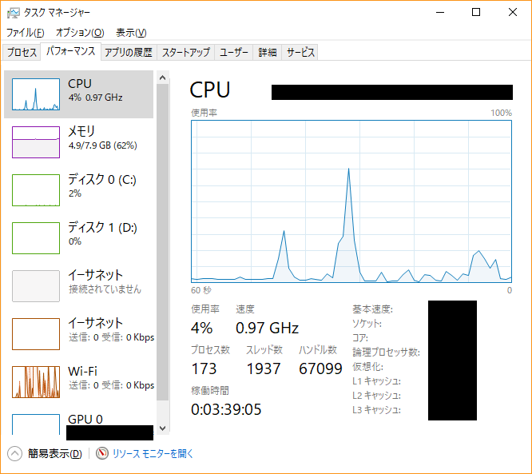
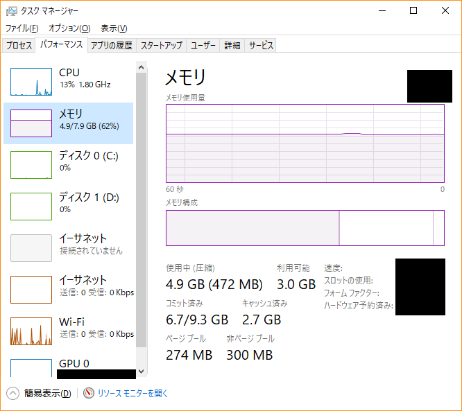

# PCとは

## 「ハードウェア、ソフトウェア、OS、アプリケーション、デバイス、デバイスドライバ、BIOS、キーボード、マウス、CPU、メモリ、インストール」というキーワードを全て使って、何か文章を書いてみよう。※100文字以上
PCは大きく分けて物理的な機器を表すハードウェアとデータ上のものを表すソフトウェアに分かれています。

PCにおけるハードウェアの基盤にはCPUやメモリなど演算や記憶を行うものでできていて、

これらの基盤部分の性能がそのままPCの性能となります。

また、基盤部分以外のハードウェアとして、ユーザの入力を補助するキーボードやマウスといった機器が挙げられます。

ハードウェアの対称としてのソフトウェアとは、データで扱うもの＝プログラムという捉え方で、

その一番の基盤部分はBIOS（今はUEFIもあります）という機器とOS（後述）をつなぐプログラムです。

PCを起動するとこのBOISが起動し、ハードウェアの接続確認をして問題がなければOSを起動します。

OSはPCを操作するためのソフトウェアで、OSの機能によって文書を作成したりネットを見たりなどの動作が

キーボードやマウスを使って簡単にできるようになります。

OS内で使用するソフトウェアをアプリケーションと呼称しますが、中にはデフォルトで入っていないものがあります。

そのような場合はCD-ROMやUSBメモリ、あるいはネットからダウンロードしてインストールする必要があります。

このインストール作業でOSのとある場所にアプリケーションのデータを構築して使えるようにします。

中にはインストールの際に専用のデバイス（機器）を用いることがあるので、その際は

デバイスドライバという、OSとデバイスをつなぐプログラムを実行して接続できるようにする必要があります。

## iPhone のおける、入力装置と、出力装置、CPUは何か書いてみよう。※100文字以上
PCにおける入力はキーボードやマウスなどで、出力はディスプレイなどですが、

iPhone（Androidも）では入出力がどちらもディスプレイとなります。

（音声の入出力などは別です。）

CPUに関してはPCと変わらずiPhoneの基板上に取り付けられています。

## オープンソース・ソフトウェアとは何か。商用OSとの違いは何か書いてみる。※100文字以上
オープンソースソフトウェアはOSSという略称で呼ばれていますが、その名の通り

ソースコードが公開されているのでソースコードの改変や再配布などが可能なソフトウェアを指します。

（LinuxなどのOSに限った話ではないです。）

つまりは誰でもソースコードを見れるので、バグなどを見つけた際にはみつけた開発者が自ら直して

元のプログラムに修正プログラムを組み込んでもらうことが可能なので

信頼性や安定性が向上します。

また、自身のシステムに応じてソースコードを改変することが可能なので、

OSS以外のソフトウェアよりも拡張性や汎用性も高いです。

ただ、規模が大きいものだと世界中で使用されているので、

特にOSSなOSは基本的に英語で取り扱っていることが多いです。

商用OSとはwindowsなどのようにある会社が値段をつけて売っているOSのことで

OSSのようにソースコードは公開されていません。

商用OSの利点として、メーカーのサポートが受けられる点です。

開発者などプログラムの扱いに慣れているのであれば自身やコミュニティで解決できますが、

そうでない人は専門的な用語などわからないことが多いので、個人での解決は困難です。

その点メーカーサポートを受ければ用語がわからずとも解決まで導いてくれますし、

日本語でのサポートを行っているものが多いです。

また、MacなどのようにOSとハードウェアが一体で売られていれば

ハードウェアの性能を最大限に活かしたOSを提供できます。

## OSの役割についてまとめよう。※50文字以上

OSはPCを操作するためのソフトウェアで、ハードウェアの管理や

アプリケーションの管理、データの管理などを行います。

ハードウェアとアプリケーションのつなぎ役と称されることもあります。

## GUIとCUIについて調べ、メリット/デメリットを書いてみる。※100文字以上

### GUI（Graphical User Interface）
GUIは視覚的にわかりやすいので直感的な操作をしやすいことが特徴です。

また、図やグラフなど文字では表しにくいものを見やすく表示できることも利点です。

しかし、描画は文字よりも多くのデータを必要とするので、その分負荷がかかります。

とくにゲーム画面など、常時描画が更新されるようなものは高負荷となります。

### CUI（Character User Interface）
CUIは文字のみでコンピュータとやり取りするので負荷がGUIよりかかりません。

また、ファイル操作などはマウスよりも手軽に行えるので、

単純な作業であればGUIより作業時間を短縮することができます。

ただし、操作を行う上でコマンドが必須なので、簡単に扱えるものではありません。

直感的に操作できないのが難点です。

## タスクマネージャを開いて、CPUやメモリの使用率（使用量）を観察してみよう。※キャプチャーで写真をとろう

### CPU使用率のキャプチャ

### メモリ使用率のキャプチャ

